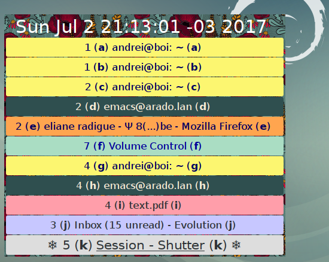

Keyboard navigation of the Linux desktop. Use the keyboard to switch between windows and workspaces. "Mouseless navigation". Shows a menu with the colored list of windows, marked by letters a-z. Colors are configurable. Pressing the key a-z "teleports" to that window. Pressing the space bar brings up the previous window. Pressing 1-9 "teleports" to the corresponding workspace. 

